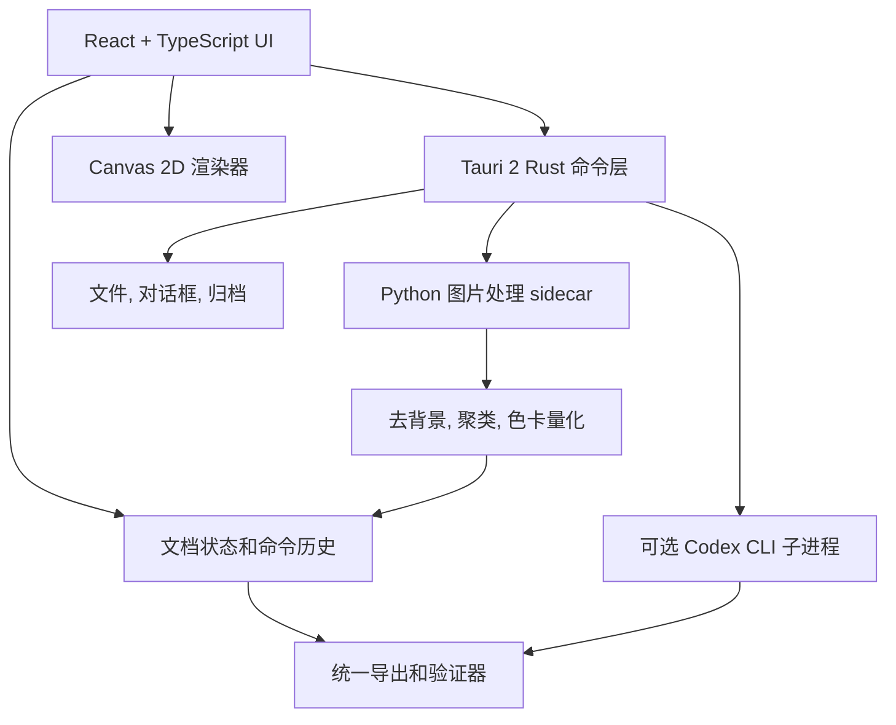

# 拼豆图纸桌面应用需求与技术方案

- 文档状态: Draft
- 日期: 2026-08-24
- 应用暂定名: PerlerDrawing Desktop
- 目标平台: Windows 10/11, Arch Linux
- 默认色号标准: MARD 221 v1

## 1. 目标

开发一个离线优先的桌面应用, 让用户可以从图片或 CSV 创建, 编辑, 校验和导出可实际拼制的拼豆图纸. 应用需要覆盖以下完整流程:

1. 导入照片, 插画或已有 CSV.
2. 在高分辨率下去背景, 简化颜色和结构.
3. 按指定色卡进行聚类和颜色量化.
4. 栅格化为指定大小的拼豆图纸.
5. 使用画笔和几何工具逐格修正.
6. 导出 CSV, 图纸图片和符合本仓库约定的 `.tar.gz` 交付包.
7. 在用户明确选择后, 可调用其本机 Codex CLI 按本仓库的 `AGENTS.md` 流程处理图片.

应用不能把原图直接缩小后当成图纸. 自动流程必须保留一个高分辨率预处理阶段, 再进行占用掩码, 栅格化, 色卡量化和逐格后处理.

## 2. 范围

### 2.1 MVP

- Windows 和 Arch Linux 桌面应用.
- 中文和英文界面即时切换.
- 浅色, 深色和跟随系统主题.
- 新建空白图纸, 设置画布宽高和板子大小.
- 设置深色分块线间距, 默认值为 5 格.
- 导入本仓库格式和常见矩阵格式的 CSV.
- 导出 CSV, 透明预览 PNG, 白底预览 PNG, 坐标图 PNG, 材料统计 CSV 和 `.tar.gz`.
- 导入 PNG, JPEG 和 WebP.
- 自动去背景, 颜色聚类, 色卡映射和尺寸压缩.
- 内置 MARD 221 v1, 并支持从规范 JSON 导入其他色卡.
- 画笔, 橡皮擦, 删除键, 吸管, 填充, 直线, 矩形和圆或椭圆工具.
- 直线和形状可设置整数格线宽. 封闭形状可选择填充或仅描边.
- 平移, 缩放, 适应窗口, 撤销和重做.
- 本机 Codex CLI 可用性检测和显式开启按钮.
- 自动保存草稿和异常退出恢复.

### 2.2 完整版

- 选区, 移动, 复制, 粘贴, 旋转和镜像.
- 竖直轴对称, 水平轴对称和中心对称绘制约束.
- 图层或至少提供母图参考层和图纸层.
- 背景掩码手工补画和擦除.
- 调色板子集自动推荐, 颜色替换和批量重映射.
- 分板导航, 分板打印和分页 PDF.
- 多种去背景模型和模型管理.
- 可配置的 Codex 任务模板和处理记录.
- 项目历史版本和差异比较.

### 2.3 暂不纳入首版

- 云端账号, 多人实时协作和在线素材库.
- 手机和平板版本.
- 内置模型训练.
- 将 Codex 作为应用运行的必要条件.
- 未经用户确认自动上传图片或调用网络服务.

## 3. 核心术语

为避免界面和导出物混淆, 应用使用以下定义:

| 术语 | 定义 |
| --- | --- |
| 画布尺寸 | 编辑器的总列数 x 总行数. 可以包含空白格. |
| 拼豆占用尺寸 | 所有非空格的最小外接矩形宽度 x 高度. 文件名中的 `size` 使用此值. |
| 板子大小 | 单块实体拼板的列数 x 行数, 用于分板和导出. |
| 分块线间距 | 编辑器中深色辅助线之间的格数, 默认 5. 它不改变图纸数据. |
| 色卡标准 | 一个带版本号的品牌色号集合, 例如 MARD 221 v1. |
| 母图 | 去背景和结构简化后的高分辨率图片, 不是最终像素图. |
| 图纸 | 每格为空或绑定到一个色卡色号的离散网格. |

## 4. 用户流程

### 4.1 从图片创建

1. 用户选择图片.
2. 导入页显示原图尺寸, alpha 状态, 预计内存和缩略图.
3. 用户选择目标色卡, 最大占用范围, 板子大小和颜色数量上限.
4. 用户选择是否自动去背景, 是否启用对称约束, 是否使用本机 Codex CLI.
5. 本地处理器先生成高分辨率母图, 再生成初始图纸.
6. 如果启用 Codex, 应用创建隔离任务目录并让 Codex 按仓库流程处理. 处理结果仍须经过本地验证器.
7. 用户在对比视图中查看原图, 母图和图纸, 然后进入编辑器.
8. 用户修正网格并导出.

### 4.2 从 CSV 创建

1. 用户选择 CSV 和对应色卡.
2. 应用检测受支持格式, 显示尺寸, 非空格数和未知色号.
3. 未知色号必须由用户选择导入自定义色卡, 映射到当前色卡或作为错误中止. 不得静默替换.
4. 导入成功后进入编辑器.

### 4.3 新建空白图纸

1. 用户设置画布宽高, 板子大小和分块线间距.
2. 用户选择色卡并把需要的颜色加入当前颜色栏.
3. 用户使用画笔或几何工具绘制.
4. 用户导出单个文件或完整归档.

## 5. 界面信息架构

应用采用单窗口桌面 SPA, 页面切换不依赖网络路由.

| 页面或区域 | 主要内容 |
| --- | --- |
| 启动页 | 新建空白图纸, 导入图片, 导入 CSV, 最近项目. |
| 图片导入页 | 去背景, 目标尺寸, 色卡, 聚类数量, 对称选项, Codex 开关, 处理预览. |
| 编辑器顶部栏 | 文件操作, 撤销重做, 缩放, 语言, 主题, 导出. |
| 编辑器左侧栏 | 画笔, 橡皮擦, 填充, 吸管, 直线, 矩形, 圆或椭圆, 选区. |
| 中央画布 | 拼豆网格, 坐标, 深色分块线, 形状预览, 母图参考层. |
| 编辑器右侧栏 | 色卡, 当前颜色, 工具参数, 画布和板子设置, 颜色统计. |
| 底部状态栏 | 光标格坐标, 当前色号, 占用尺寸, 拼豆总数, 后台任务状态. |
| 导出页 | 文件选择, 图纸标识, 预览, 校验结果和输出目录. |
| 设置页 | 语言, 主题, 默认色卡, 模型目录, Codex CLI 状态, 缓存管理. |

### 5.1 UI 设计原则

- 视觉风格简洁, 高对比, 重点突出画布和当前色号.
- 主题由设计令牌驱动, 不为深色模式复制组件样式.
- 中文和英文文本长度不同, 按钮和侧栏不得依赖固定文本宽度.
- 颜色不能是唯一状态提示. 当前颜色, 错误和选中状态同时使用边框, 图标或文字.
- 所有工具可用鼠标完成, 核心操作也提供键盘快捷键.
- 焦点样式清晰, 弹窗可使用键盘关闭, 工具提示不遮挡绘制位置.

## 6. 绘制和数据编辑需求

### 6.1 网格模型

- 一个格子只存空值或当前色卡中的颜色索引.
- 网格内部使用紧凑的一维 `Uint16Array` 或等价结构, 不为每格创建 React 对象.
- 空格使用保留值, 例如 `65535`.
- 色号, RGB, 名称和品牌信息只存于调色板表中.
- 文档操作使用命令对象记录, 支持撤销和重做.

### 6.2 基础工具

| 工具 | 行为 |
| --- | --- |
| 画笔 | 单击绘制一格, 拖动连续绘制. 支持整数格宽度. |
| 橡皮擦 | 清空目标格. `Delete` 删除选区或当前格. |
| 吸管 | 读取目标格色号并设为当前颜色. |
| 填充 | 对相邻同值区域执行洪泛填充. |
| 直线 | 拖动端点, 使用格点离散算法生成预览, 提交后写入网格. |
| 矩形 | 可选描边或填充, 支持整数格线宽. |
| 圆或椭圆 | 可选描边或填充, 支持整数格线宽, 提交前显示格级预览. |
| 选区 | 框选, 移动, 清空, 复制和粘贴. 可在完整版本实现. |

几何工具必须以格为单位确定结果. 在鼠标拖动期间只显示临时预览, 松开后作为一次可撤销操作提交. 相同输入必须生成相同网格.

### 6.3 网格和分板显示

- 普通格线使用低对比颜色.
- 每隔 `N` 格绘制深色分块线, `N` 默认是 5.
- 板子边界比普通分块线更明显.
- 深色线, 坐标和板子边界只属于视图层, 不写入 CSV.
- 用户修改画布大小时, 如果会裁掉非空格, 必须先显示影响范围并二次确认.

### 6.4 调色板操作

- 色卡选择器显示品牌, 版本和颜色数量.
- 当前文档保存色卡标识和色卡内容快照, 避免未来色卡更新改变旧图纸.
- 用户可以从所选标准中搜索并添加颜色到快捷栏.
- 删除未使用颜色可以直接执行.
- 删除正在使用的颜色时, 必须选择替换色或明确清空对应格.
- 用户可以导入自定义色卡 JSON, 但必须通过 schema 校验并使用独立命名空间.

## 7. 图片自动转换管线


### 7.1 解码和预处理

- 支持 PNG, JPEG 和 WebP.
- 读取 EXIF 方向并在处理前校正.
- 限制最大像素数, 防止异常文件耗尽内存.
- 统一为 sRGB 工作空间. 如果无法正确转换嵌入色彩配置, 应提示用户.
- 原图和母图保留在项目临时目录, 不覆盖源文件.

### 7.2 自动去背景

- 首选使用本地 `rembg` 和 ONNX Runtime CPU 后端.
- 当前离线基础处理器实现边框 Lab 聚类和边界连通 alpha matte, 不依赖下载模型. 它只移除可从图像边界到达的候选背景, 并为触边主体增加角点和主导边框簇保护. 后续加入经过许可证审核的 `rembg` 模型时, 该方法继续作为无模型回退.
- 用户可以关闭自动去背景, 或在完整版本中手工修正掩码.
- 输出必须是带 alpha 的高分辨率 PNG.
- 边缘处理需要去除半透明彩边, 但不得侵蚀细小且有意义的结构.
- 模型文件采用按需下载加 SHA-256 校验, 或由用户指定本地路径.
- 在分发任何模型权重前必须独立审核其许可证. Python 包的开源许可证不代表所有模型权重都允许再分发或商用.

### 7.3 结构简化

- 在降采样前合并噪点, 纹理, 复杂反光和无意义阴影.
- 外包边仅在不承担内部结构时去除.
- 对称主体在母图阶段校正, 量化后再次逐格强制对称.
- 必须保护孔洞, 环, 中心线, 眼睛高光和尖端等语义细节.
- 用户可查看处理前后对比并重新调整参数.
- 当前处理器使用两层 Haar 小波软阈值减少高频纹理, 再按边缘能量混回强轮廓, 并在高分辨率母图上执行 Lab 聚类. 小波与聚类均发生在最终拼豆栅格化之前.

### 7.4 缩放和占用掩码

- 不使用最近邻直接压缩照片.
- 使用预乘 alpha 的面积或 BOX 重采样, 防止透明背景颜色污染边缘.
- alpha 阈值作为项目参数保存.
- 小连通分量清理必须允许关闭, 并保护被标记的关键结构.
- 目标尺寸区分最大占用范围和画布尺寸.

### 7.5 聚类和色卡量化

- 在 Lab 感知色彩空间进行聚类和最近色计算.
- 聚类先得到紧凑的代表色, 再映射到所选色卡的真实 RGB 和色号.
- 默认使用 MARD 221 v1.
- 可设置最大颜色数, 也可固定必须使用或禁止使用的色号.
- 清理零使用颜色后重新生成材料统计.
- 肤色, 金属, 金色和高饱和强调色等语义颜色需要在预览中重点检查.

### 7.6 后处理和验证

- 检查非预期断裂, 单格悬空, 孔洞, 尖端和中心线.
- 如果启用轴对称或中心对称, 对应格的占用状态和色号必须完全一致.
- 从最终非空格重新计算占用外接矩形.
- 所有色号必须存在于文档色卡快照中.
- 材料统计总数必须等于非空格数.
- 验证失败时不得只修改预览图. CSV, 图片, 统计和元数据必须来自同一份文档状态.

## 8. CSV 和项目数据格式

### 8.1 内部文档

内部格式建议使用带 schema 版本的 JSON 元数据和独立二进制网格. 概念结构如下:

```ts
interface PatternDocument {
  schemaVersion: 1;
  artifact: {
    name: string;
    version: `v${number}`;
  };
  canvas: {
    columns: number;
    rows: number;
  };
  board: {
    columns: number;
    rows: number;
    subdivision: number;
  };
  palette: {
    standardId: string;
    version: string;
    colors: PaletteColor[];
  };
  symmetry: {
    type: "none" | "vertical" | "horizontal" | "central";
    axisOrCenter?: number[];
  };
  processing: Record<string, unknown>;
}
```

实际格子数组不应直接展开成巨大 JSON. 保存项目时可把 `document.json`, 网格二进制, 母图和缩略图封装为应用自己的项目文件.

### 8.2 CSV 导入

至少支持两类格式:

1. 本仓库的矩阵色号格式. 第一行和第一列可以带坐标, 每个数据格为空或色号.
2. 简单矩阵格式. 每个单元格为空, 色号或十六进制 RGB.

导入器需要:

- 自动识别 UTF-8 BOM, 逗号和制表符.
- 正确处理引号和换行, 不使用手写字符串分割.
- 校验行宽一致, 尺寸上限和色号合法性.
- 显示未知色号及其坐标.
- 让用户选择转置或翻转, 但不得自动猜测并静默变换.

### 8.3 CSV 导出

- 默认导出本仓库兼容的矩阵色号格式.
- 空格保持为空.
- 可选包含行列坐标.
- 文件编码使用 UTF-8 with BOM, 便于 Windows 表格软件识别.
- 导出后立即回读并执行一次 round-trip 校验.

## 9. 导出物

完整导出使用 `<name>_<width>x<height>_<version>` 作为图纸标识. `width x height` 必须来自最终非空格的最小外接矩形.

```text
<id>.tar.gz
└── <id>/
    ├── README.md
    ├── <id>.csv
    ├── <id>_preview.png
    ├── <id>_preview_white.png
    ├── <id>_chart.png
    ├── <id>_inventory.csv
    ├── <id>_metadata.json
    ├── <id>_palette.json
    └── tiles/
        └── <id>_board_rN_cN.png
```

### 9.1 图片导出

- 透明预览: 一格对应一个像素或指定无插值放大倍数.
- 白底预览: 用于普通图片查看器.
- 完整图纸: 带网格, 坐标和格内色号.
- 分板图: 按板子大小切分, 并保留全局坐标.
- PNG 元数据应记录应用版本, 文档 ID 和色卡 ID, 但不写入用户源图片路径.

### 9.2 归档安全

- 创建归档时使用相对路径, 禁止写入工作目录之外的文件.
- 如未来支持导入项目归档, 必须拒绝绝对路径和 `..` 路径, 防止路径穿越.
- 归档中不包含 Codex 登录信息, 应用日志, 缓存或未授权的原图.

## 10. Codex CLI 可选集成

### 10.1 可行性结论

可以调用用户已经安装和登录的 Codex CLI. 当前本机 `codex-cli 0.146.1` 的 `codex exec` 支持非交互运行, 图片附件, JSONL 事件输出, 指定工作目录和沙箱策略. 该能力应标记为实验性可选处理器, 本地自动转换功能不能依赖它.

### 10.2 用户交互

- 图片导入页提供 `使用本机 Codex CLI 处理` 开关, 默认关闭.
- 开关旁显示检测结果, CLI 版本, 当前工作目录和权限说明.
- 第一次执行前要求用户确认输入图片, 输出目录和允许写入范围.
- 任务面板显示阶段, JSONL 进度, 最近消息, 运行时间和取消按钮.
- Codex 未安装, 未登录或运行失败时, 保留原图和参数并允许改用本地处理器.

### 10.3 调用方式

应用通过参数数组启动进程, 禁止把用户路径拼接成 shell 字符串. 等价命令如下:

```bash
codex exec \
  --image <input-image> \
  --json \
  --ephemeral \
  --sandbox workspace-write \
  --cd <isolated-job-repository> \
  "<generated-task-prompt>"
```

具体参数以目标机器上的 `codex exec --help` 为准. 集成层需要按版本探测能力, 不应假设未来所有版本的参数完全一致.

### 10.4 隔离工作目录

每个任务创建独立临时 Git 仓库, 只放入以下内容:

- 输入图片的任务副本.
- 当前色卡副本.
- 本仓库 `AGENTS.md` 和必要的项目说明.
- 允许 Codex 使用的转换脚本或已安装应用处理命令.
- 唯一允许写入的 `output/` 目录.

应用不读取, 复制或展示 `~/.codex/auth.json`. 认证完全交给用户自己的 Codex CLI. 默认使用 `workspace-write`, 不提供 `danger-full-access` 快捷选项.

### 10.5 结果接收

Codex 输出不能直接成为可信文档. 导入前必须执行:

1. 路径和文件类型检查.
2. CSV schema 和尺寸检查.
3. 色号是否属于所选色卡的检查.
4. 非空格和材料统计一致性检查.
5. 对称, 占用范围, alpha 和归档内容检查.
6. 通过后把结果转换为内部 `PatternDocument`.

如果 Codex 环境没有所需图像工具, 它可以调用随任务提供的本地转换脚本. 应用不得假设所有 Codex 安装都具备图像生成或联网能力.

## 11. 技术架构

### 11.1 选择

采用 Tauri 2 + React + TypeScript + Python sidecar.



### 11.2 前端

- 语言: TypeScript, 开启 `strict`.
- 框架: React + Vite.
- 国际化: i18next + react-i18next, 资源至少包含 `zh-CN` 和 `en-US`.
- 状态: Zustand 或同等级轻量 store. 文档状态, UI 状态和后台任务状态分开.
- 组件: Radix UI primitives 配合本地设计令牌和组件封装. 可以使用 shadcn/ui 作为源码起点, 不把它当作运行时依赖框架.
- 测试: Vitest + React Testing Library.

画布不使用每格一个 DOM 元素的实现. React 只管理工具栏, 面板和文档级状态. 网格, 选区和预览由 Canvas 2D 分层绘制, 大画布使用离屏缓冲和脏矩形更新.

### 11.3 Tauri 和 Rust

- 语言: Rust stable.
- 职责: 文件对话框, 项目读写, 安全路径处理, 子进程生命周期, tar.gz 创建, 系统主题和应用更新.
- 所有命令采用明确输入 schema, 不暴露任意 shell 执行接口.
- Tauri capability 只允许启动已知 Python sidecar 和检测到的 Codex 可执行文件.
- 子进程支持进度事件, 超时, 取消和退出码处理.

### 11.4 Python sidecar

- 语言版本: Python 3.12.
- 建议库: Pillow, NumPy, SciPy, scikit-learn, rembg, onnxruntime, scikit-image.
- 职责: 图片解码, 去背景, alpha 处理, 聚类, Lab 色差, 连通分量和现有图纸算法复用.
- 通信: stdin/stdout 上的 JSON Lines. 大图片和结果通过任务目录中的文件传递, 不放入 JSON.
- 进度事件必须带 `job_id`, `stage`, `progress`, `message_key`.
- 错误输出使用结构化错误码, UI 再翻译为当前语言.

现有 `scripts/make_perler_pattern.py` 的通用逻辑应逐步抽取为可导入模块, CLI 脚本保留为薄入口. `scripts/refine_tempus_pattern.py` 是专项示例, 不应作为通用算法直接调用.

### 11.5 备选方案和取舍

| 方案 | 优点 | 未选择原因 |
| --- | --- | --- |
| PySide6 + QML | 单一 Python 生态, 复用算法最直接. | 复杂 Canvas 编辑体验, Web UI 组件生态和前端测试便利性较弱. |
| Electron + React | Node 子进程集成简单, 跨平台成熟. | 安装体积和内存开销通常高于 Tauri. |
| 全 Rust + Tauri | 单一可执行链, 运行时可控. | 去背景模型和现有 Python 算法迁移成本高, 首版风险较大. |

如果后续验证发现 Python sidecar 打包是主要阻碍, 可以把稳定的颜色量化和导出逻辑迁移到 Rust, 但去背景模型仍保留为可选进程.

## 12. 性能和可靠性目标

- 300 x 300 网格上的缩放和基础绘制目标为可连续交互, 不因 React 重渲染所有格子.
- 图片和聚类任务在后台进程运行, 不阻塞 UI 线程.
- 每个长任务可取消, 取消后回收子进程和临时目录.
- 项目文件采用原子写入, 先写临时文件, 校验后替换.
- 自动保存不写入导出目录, 并保留最近若干恢复点.
- 所有随机算法保存 seed, 相同输入和参数可以复现.
- 导出物由一个不可变文档快照生成, 避免导出期间继续绘制造成文件不一致.

## 13. 安全和隐私

- 默认离线运行. 本地处理器不上传图片.
- Codex 功能默认关闭, 启用时明确说明 Codex CLI 可能依据用户配置访问网络.
- 不读取 Codex 凭据文件, 不在应用日志中记录 token.
- 日志默认不包含完整源路径, 图片内容或 CSV 内容.
- 对输入图片像素数, CSV 行列数, 解压大小和归档文件数设置上限.
- 所有导入路径执行规范化和工作目录边界检查.
- 外部命令使用 argv 数组和固定可执行路径, 不经过 shell.
- 下载模型时校验来源, 许可证, HTTPS 和 SHA-256.
- 发布版本启用依赖审计, Rust `cargo audit`, 前端锁文件审计和 Python 依赖扫描.

## 14. 测试和验收

### 14.1 单元测试

- 直线, 矩形, 圆和椭圆的格点结果.
- 不同线宽和填充模式.
- 洪泛填充边界.
- 撤销和重做的可逆性.
- 占用外接矩形计算.
- 轴对称和中心对称校验.
- Lab 色卡映射和未知色号错误.
- CSV 读写 round-trip.
- tar.gz 路径安全.

### 14.2 集成测试

- 固定图片到固定色卡的 golden output.
- 背景透明边缘不被底色污染.
- 导出材料数量等于非空格数.
- 归档包含全部必需文件.
- Python sidecar 的启动, 进度, 取消和失败恢复.
- Codex 模拟进程的 JSONL 解析, 超时和非零退出码.

### 14.3 UI 测试

- 中英文资源 key 完全一致.
- 深色和浅色主题关键页面截图比较.
- 键盘导航, 焦点管理和快捷键冲突.
- 画布缩放后点击坐标仍准确.
- Windows 125% 和 150% 缩放下界面可用.

### 14.4 发布验收

1. Windows 安装, 启动, 卸载和升级测试通过.
2. Arch Linux 安装包可由 `pacman -U` 安装和卸载.
3. 在无 Codex, 无网络和无去背景模型时仍可新建, 编辑和导入 CSV.
4. 在没有 Python 开发环境的干净机器上 sidecar 可以运行.
5. 用仓库已有项目完成一次导入和导出回归测试.
6. 导出归档通过本仓库 `AGENTS.md` 的最终验证要求.

## 15. 打包方案

### 15.1 Python sidecar

- 使用 PyInstaller 为每个目标系统分别构建.
- 首版优先使用 `onedir`, 便于诊断缺失动态库和模型文件. 稳定后再评估 `onefile`.
- Windows sidecar 必须在 Windows runner 上构建.
- Arch sidecar 必须在 Arch 环境中构建. PyInstaller 不是跨平台编译器.
- sidecar 文件名遵循 Tauri external binary 的目标三元组约定.

### 15.2 Windows

- Tauri 生成 NSIS `.exe` 安装器.
- 可选生成 MSI, 但 MSI 构建和验证应放在 Windows runner.
- 安装器提供中英文界面.
- 正式发布前配置代码签名, 避免 SmartScreen 对未签名应用产生更强警告.
- 安装包内包含应用, WebView2 策略和 Python sidecar, 不要求用户安装 Python.

### 15.3 Arch Linux

- 提供原生 `.pkg.tar.zst`.
- `packaging/arch/PKGBUILD` 以已构建的 Tauri binary, desktop file, icon 和 sidecar 组包.
- 在 `archlinux:base-devel` 容器或自托管 Arch runner 中使用非 root 构建用户运行 `makepkg`.
- 同时可提供 AppImage 作为通用 Linux 备用包, 但 Arch 用户优先使用 pacman 包.
- 如果链接依赖无法稳定兼容滚动发行版, 在发布说明中记录构建时的 Arch snapshot 或容器标签.

## 16. GitHub Actions 方案

应用脚手架和依赖锁文件创建后, 新增 `.github/workflows/desktop-release.yml`. 当前阶段不提交不可执行的占位 workflow.

### 16.1 触发条件

- Pull Request: 只运行检查和测试.
- Push 到 `main`: 运行检查, 不创建正式 release.
- 标签 `app-v*`: 构建 Windows 和 Arch 安装包并创建 GitHub Release.
- `workflow_dispatch`: 手工构建测试包.

### 16.2 Jobs

| Job | Runner | 内容 |
| --- | --- | --- |
| quality | ubuntu-latest | pnpm lint, TypeScript typecheck, Vitest, cargo fmt/check/test, pytest. |
| build-windows | windows-latest | 安装 Node, Rust, Python, 构建 PyInstaller sidecar, 运行 Tauri build, 产出 NSIS 和可选 MSI. |
| build-arch | ubuntu-latest + Arch container | 安装 base-devel, Node, Rust 和 Python, 以非 root 用户构建 sidecar 和 Tauri, 使用 PKGBUILD 产出 `.pkg.tar.zst`. |
| release | ubuntu-latest | 校验哈希, 汇总变更, 上传经过测试的安装包和 SHA-256 文件. |

### 16.3 发布安全

- Actions 使用固定 major 或 commit SHA 的官方和可信 action.
- PR 不读取签名密钥和发布 token.
- Windows 签名证书只在标签发布 job 中解密并使用.
- GitHub Release 上传前生成 SHA-256 清单.
- 每个平台独立构建 Python sidecar, 不跨平台复用二进制 artifact.
- 构建日志不得输出证书, token 或 Codex 配置.

### 16.4 Tauri action

Tauri 官方 `tauri-action` 支持在 GitHub Actions 中构建和发布, 并可用 `projectPath` 指向非仓库根目录的 `desktop_app`. 是否直接由 action 创建 release, 或由独立 `release` job 汇总, 在实现时选择后者以便先统一校验安装包和哈希.

## 17. 计划目录结构

```text
desktop_app/
├── README.md
├── docs/
│   └── product-requirements-and-technical-plan.md
├── package.json
├── pnpm-lock.yaml
├── vite.config.ts
├── src/
│   ├── app/
│   ├── components/
│   ├── editor/
│   │   ├── canvas/
│   │   ├── commands/
│   │   ├── tools/
│   │   └── model/
│   ├── features/
│   │   ├── image-import/
│   │   ├── csv/
│   │   ├── palettes/
│   │   ├── export/
│   │   └── codex/
│   ├── i18n/
│   └── styles/
├── src-tauri/
│   ├── Cargo.toml
│   ├── capabilities/
│   ├── icons/
│   └── src/
├── python/
│   ├── pyproject.toml
│   ├── perler_processor/
│   └── tests/
├── packaging/
│   ├── arch/PKGBUILD
│   └── windows/
└── tests/
```

按功能组织前端代码, 不建立一个混杂所有组件的全局 `components` 目录. 画布算法和文档模型必须与 React 组件解耦, 以便单元测试和未来迁移.

## 18. 实施阶段

### 阶段 1: 基础编辑器

- 创建 Tauri, React 和 TypeScript 脚手架.
- 建立设计令牌, 中英文和主题切换.
- 实现内部文档, Canvas 网格, 画笔, 橡皮擦, 直线, 矩形, 圆, 撤销和重做.
- 实现色卡 registry 和 MARD 导入.
- 实现 CSV 导入和导出.

### 阶段 2: 图片转换和完整导出

- 抽取现有 Python 通用算法.
- 建立 sidecar 协议和后台任务 UI.
- 实现去背景, 聚类, 色卡量化和预览对比.
- 实现 PNG, inventory, metadata, tiles 和 tar.gz.
- 建立本地验证器和 golden tests.

### 阶段 3: Codex 和安装包

- 实现 CLI 探测, 任务隔离, JSONL 进度和取消.
- 实现 Codex 结果验证和导入.
- 构建 Windows NSIS 和 Arch PKGBUILD.
- 增加 GitHub Actions, 签名和发布校验.

### 阶段 4: 高级编辑能力

- 选区, 变换, 对称绘制和掩码修正.
- 分板打印, PDF 和项目版本比较.
- 性能分析和大画布优化.

## 19. 开发工具

| 类别 | 工具 |
| --- | --- |
| Node 包管理 | pnpm, 通过 Corepack 固定版本. |
| 前端 | React, TypeScript, Vite, i18next, Radix UI. |
| 桌面 | Tauri 2, Rust stable. |
| 图像处理 | Python 3.12, Pillow, NumPy, SciPy, scikit-learn, rembg, ONNX Runtime. |
| Python 打包 | PyInstaller. |
| 测试 | Vitest, React Testing Library, pytest, Rust test. |
| 代码质量 | ESLint, Prettier, Ruff, mypy, rustfmt, Clippy. |
| 发布 | GitHub Actions, tauri-action, NSIS, PKGBUILD, makepkg. |

所有语言和依赖版本在脚手架创建时写入锁文件. 不在文档中固定尚未验证的具体小版本.

## 20. 待确认的产品决策

这些问题不阻塞当前目录和架构, 但应在对应阶段开始前确认:

- 首版是否必须支持导入 Hama, Artkal 等内置色卡, 还是先提供自定义色卡导入.
- 默认板子大小是 29 x 29, 50 x 50, 还是仅记住用户上次选择.
- CSV 的首选兼容目标是本仓库格式还是某个现有拼豆软件格式.
- 去背景模型是首次使用时下载, 还是提供一个经过许可证审核的内置模型.
- Windows 首发只提供 NSIS, 还是同时提供 MSI.
- Codex 处理是否允许使用当前仓库, 或始终限制在临时 Git 仓库.

建议默认选择: 内置 MARD 加自定义色卡导入, 记住上次板子大小, 以本仓库 CSV 为规范格式, 模型首次使用时下载, Windows 首版只提供 NSIS, Codex 始终在临时 Git 仓库运行.

## 21. 参考资料

- [Tauri distribution](https://v2.tauri.app/distribute/)
- [Tauri GitHub Actions pipeline](https://v2.tauri.app/distribute/pipelines/github/)
- [Tauri Windows installer](https://v2.tauri.app/distribute/windows-installer/)
- [Tauri sidecar](https://v2.tauri.app/develop/sidecar/)
- [Tauri AppImage](https://v2.tauri.app/distribute/appimage/)
- [PyInstaller operating mode](https://www.pyinstaller.org/en/stable/operating-mode.html)
- [Arch Linux PKGBUILD](https://wiki.archlinux.org/title/PKGBUILD)
- [Arch Linux package creation](https://wiki.archlinux.org/title/Creating_packages)
- [rembg repository](https://github.com/danielgatis/rembg)
- [ONNX Runtime documentation](https://onnxruntime.ai/docs/)
- [Codex CLI reference](https://developers.openai.com/codex/cli/reference)
- [Codex non-interactive mode](https://developers.openai.com/codex/noninteractive)
